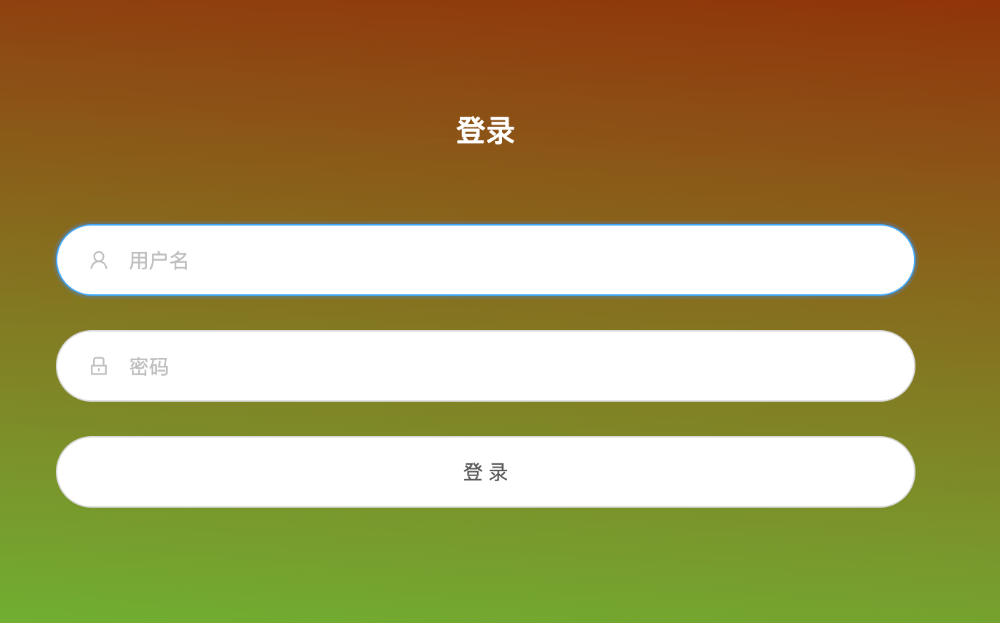

# 拥抱IPv6，30分钟搞定校园网免流量，顺便翻墙（零基础教程）

——以Google Cloud Plantform(GCP)为例，演示通过Vless（Reality协议）搭建IPv6代理以实现教育网免流量顺便翻墙。

Cypherpunk Li 

# Preparation

- A VISA/Master Debit/Credit Card (essential for GCP to obtain a $300 bonus for new users, AliPay might be Okay for other server providers)
- A laptop connected to the global Internet (At least the access to the Google)
- A network cable (recommended, but not essential)

- IPv6 Access 

# Choose a VPS

VPS is short for a virtual private server, to make it easy, you can consider it as a remote computer that is on and connected to the internet 24/7. Domestic and international Internet giants provide such cloud services, the most famous ones are Amazon Web Services (AWS), Google Cloud Platform (GCP), Microsoft Azure, Alibaba Cloud, Tencent Cloud, and Huawei Cloud……

In order to go through the Great Fire Wall (GFW, the unofficial name for the censorship infrastructure set between China and the Internet, which bans you from Google), we might choose a VPS set out of China mainland. If you just need data fee-free domestic net access, you might choose a domestic VPS service. (Btw, you can use this method to pretend to be a resident in any province, to see if you will meet geographical discrimination on social media.) 

Needless to say, the VPS must support IPv6. Internet Giants usually support IPv6. GCP has a $300-400 bonus for new users, so this time I will use it as an example.

# Activate Cloud Account (…)

1. Since all Google services have been locked by GFW since 2014, use any free VPNs temporally to go through the wall. If you don't know how to do it, consult your classmates.

2. Click this link https://cloud.google.com to log in to Google Cloud Platform Using your Google account. (If you do not have a Google account, just sign one up.) 
3. You will need your Visa/Master card in this step to verify your identity, just follow the procedure, and you can successfully log in to the following console.

# Setup VPS (…)

1. Follow this document to open IPv6 support to your subnet. https://cloud.google.com/vpc/docs/create-modify-vpc-networks#subnet-enable-ipv6

   If you don't see the IPv6 setting in this guide, which means the default VPC network doesn't support IPv6, create a new VPC network.

2. Follow this document to set up a new VPS instance and configure IPv6 for instances https://cloud.google.com/compute/docs/ip-addresses/configure-ipv6-address 

3. Connect to your VPS using SSH or Browser Shell.

SSH

```bash
# ping the IPv6 ip address to check you can connect to the VPS
ping6 YOUR_IPV6_ADDRESS

# link to the VPS using SSH
ssh username@YOUR_IPV6_ADDRESS
```


# Build the Xray Reality

## Install the required components

For Debian (Ubuntu included)

```bash
apt update -y 
apt install curl wget -y
```

For CentOS (Red Hat)

```bash
apt update -y 
apt install curl wget -y
```

## Install x-ui

In this guide, for convenience, we use a third-party script. It is the link. https://github.com/FranzKafkaYu/x-ui/ 

```bash
# 中文版
bash <(curl -Ls https://raw.githubusercontent.com/FranzKafkaYu/x-ui/master/install.sh)
```

```bash
# for English users
bash <(curl -Ls https://raw.githubusercontent.com/FranzKafkaYu/x-ui/master/install_en.sh)
```

if the command doesn't work try this break-up version instead.

```bash
# change the working directory
cd ~
# Download the script
curl -L https://raw.githubusercontent.com/FranzKafkaYu/x-ui/master/install.sh > install.sh
# add execuative authority
sudo chmod +x install.sh
# run 
sudo ./install.sh
```

If it goes properly, you may asked to set up a password and username, and then the x-ui interface is set.

To check the configuration of x-ui:

```bash
sudo x-ui
```

You will see:

```bash
  x-ui 面板管理脚本
  0. 退出脚本
————————————————
  1. 安装 x-ui
  2. 更新 x-ui
  3. 卸载 x-ui
————————————————
  4. 重置用户名密码
  5. 重置面板设置
  6. 设置面板端口
  7. 查看当前面板信息
————————————————
  8. 启动 x-ui
  9. 停止 x-ui
  10. 重启 x-ui
  11. 查看 x-ui 状态
  12. 查看 x-ui 日志
————————————————
  13. 设置 x-ui 开机自启
  14. 取消 x-ui 开机自启
————————————————
  15. 一键安装 bbr (最新内核)
  16. 一键申请SSL证书(acme申请)
  17. 配置x-ui定时任务

面板状态: 已运行
是否开机自启: 是
xray 状态: 运行
请输入选择 [0-17],查看面板登录信息请输入数字:
```

Type:

```bash
7
```

You will see:

```bash
[INF] 当前面板信息[current panel info]:
面板版本[version]: 0.3.4.4:20230717
用户名[username]: XXXXX #remember it!
密码[userpasswd]: XXXXXXX #remember it!
监听端口[port]: XXXXX #remember it
根路径[basePath]: /XXXX/ #remember it
```

## Login to x-ui and set up a node

1. Go to browser and type in the address block:

```
http://[YOUR_IPV6_ADDRESS]:port/basePath/
```

For example my IPv6 address is *2600:1900:1134:268::* , my port is 12345, my bashPath is /hp23/, then I should type:

```
http://[2600:1900:1134:268::]:12345/hp23/
```

2. Then you can see the following page:



Use your username and passcode to log in.

3. Set up a node:

- check the core version and change to the most up-to-date version


- Add a node


- Name the node and open Reality


- Add user and set flow control system


- Click Save 

# Using the node (…)

## Recommend Clients

### Window

V2rayN


### MacOS(Apple Scillion M1)

Shadowrocket (iPad Version)


### iOS/iPad OS

Shadowrocket


### Andriod

V2rayNG


Other clients may refer to Appendix 3. 

## Notice to data fee-free 

Best Practice:

1. Using a network cable to connect to a PC RJ45 Port
2. no need to log in to the school internet.
3. Turn on the proxy client (For example, the V2rayN icon will turn red)
4. Enjoy the **FREE** internet.

Other choices:

1. Connecting to school wifi, like BNU-Mobile using your phone

2. go to settings and change the Wi-Fi settings

   - Change the IPv4 address mode to manual, and change the IPv4 address to anything wrong

   - keep the IPv6 address auto and right.

3. Turn on proxy client like Shadowrocket.

4. Enjoy the **FREE** internet.

# Appendix

1. How to get a VISA/Master Card for College Students

Students who have traveled internationally, or gone online oversea shopping might be familiar with these VISA/Master Cards. That usually includes several categories, including Credit, Debit, and Prepaid Debit.

According to regulations, now it is nearly impossible for a student without a paid job to get a V/M credit card from banks in China Mainland alone. Most undergraduate students are only allowed to open a UnionPay credit without any overdraft, to be honest, these "fake" UnionPay credit cards are useless.

I highly recommend opening an attached card of your parent's credit account. You can share the overdraft limit of your parent and get all the benefits and convenience of a credit card. Both you and your parent can pay the credit card bill. The only drawback is that your parent will be able to monitor your consumption. If you can not get an attached card, another recommendation is to apply for a VISA/Master Debit card, one of the popular choices is BOC Monet Debit (Mastercard).

However, if you are going abroad or to HK SAR in the near future, you may easily open such accounts in their bank branches. In Bank of America, you may even get a cash-back credit card without an SSN (Social Secure Number, similar to an ID number). In HK, you can easily open a digital bank account (like ZA Bank) using your phone.

Another choice is a prepaid VISA/Master debit card. Fintech companies like Wise, PayPal, and Venmo not only provide low-cost and fast financial services but may also provide prepaid debit, and you can even buy a prepaid debit card from most convenience stores in the US. However, it's hard to activate unless you already have a foreign-issued card or a valid foreign address or residence ID. 

Another category of easy-to-apply VISA/Master debit is called USDT card, it was first designed to help cryptocurrency holders consume or withdraw cash safely, and with the increasing needs of GPT-4.0 subscriptions for non-US Users, they have been gaining popularity. But remember many of the USDT card companies are in a gray area or, worse: high service fees, no deposit insurance, taking money and running, disobeying foreign exchange management law, selling your personal data (if KYC is needed), and even involving in money laundering, so unless you totally understand the industry, that can be nightmares for any green hand users out of the crypto circle.

2. IPv6 Access Check

Open this link https://www.test-ipv6.com/ if you get 10 scores, then you have full access to the IPv6. OR Open https://byr.pt OR Manually check the network settings. 

3.  Other [GUI Clients](https://github.com/XTLS/Xray-core#gui-clients)

   - OpenWrt
     - [PassWall](https://github.com/xiaorouji/openwrt-passwall), [PassWall 2](https://github.com/xiaorouji/openwrt-passwall2)
     - [ShadowSocksR Plus+](https://github.com/fw876/helloworld)
     - [luci-app-xray](https://github.com/yichya/luci-app-xray) ([openwrt-xray](https://github.com/yichya/openwrt-xray))
   - Windows
     - [v2rayN](https://github.com/2dust/v2rayN)
     - [NekoRay](https://github.com/Matsuridayo/nekoray)
     - [Furious](https://github.com/LorenEteval/Furious)
     - [HiddifyN](https://github.com/hiddify/HiddifyN)
     - [Invisible Man - Xray](https://github.com/InvisibleManVPN/InvisibleMan-XRayClient)
   - Android
     - [v2rayNG](https://github.com/2dust/v2rayNG)
     - [HiddifyNG](https://github.com/hiddify/HiddifyNG)
     - [X-flutter](https://github.com/XTLS/X-flutter)
   - iOS & macOS arm64
     - [Mango](https://github.com/arror/Mango)
     - [FoXray](https://apps.apple.com/app/foxray/id6448898396)
     - [Streisand](https://apps.apple.com/app/streisand/id6450534064)
   - macOS arm64 & x64
     - [V2rayU](https://github.com/yanue/V2rayU)
     - [V2RayXS](https://github.com/tzmax/V2RayXS)
     - [Furious](https://github.com/LorenEteval/Furious)
     - [FoXray](https://apps.apple.com/app/foxray/id6448898396)
   - Linux
     - [v2rayA](https://github.com/v2rayA/v2rayA)
     - [NekoRay](https://github.com/Matsuridayo/nekoray)
     - [Furious](https://github.com/LorenEteval/Furious)

   [Others that support VLESS, XTLS, REALITY, XUDP, PLUX...](https://github.com/XTLS/Xray-core#others-that-support-vless-xtls-reality-xudp-plux)

   - iOS & macOS arm64
     - [Shadowrocket](https://apps.apple.com/app/shadowrocket/id932747118)
   - Xray Tools
     - [xray-knife](https://github.com/lilendian0x00/xray-knife)
   - Xray Wrapper
     - [XTLS/libXray](https://github.com/XTLS/libXray)
     - [xtlsapi](https://github.com/hiddify/xtlsapi)
     - [AndroidLibXrayLite](https://github.com/2dust/AndroidLibXrayLite)
     - [XrayKit](https://github.com/arror/XrayKit)
     - [Xray-core-python](https://github.com/LorenEteval/Xray-core-python)
   - XrayR
     - [XrayR-release](https://github.com/XrayR-project/XrayR-release)
     - [XrayR-V2Board](https://github.com/missuo/XrayR-V2Board)
   - Clash.Meta
     - [Clash Verge](https://github.com/zzzgydi/clash-verge)
     - [clashN](https://github.com/2dust/clashN)
     - [Clash Meta for Android](https://github.com/MetaCubeX/ClashMetaForAndroid)
     - [meta_for_ios](https://t.me/meta_for_ios)
   - sing-box
     - [installReality](https://github.com/BoxXt/installReality)
     - [sbox-reality](https://github.com/Misaka-blog/sbox-reality)
     - [sing-box-for-ios](https://github.com/SagerNet/sing-box-for-ios)

# Reference (…)

[1] https://github.com/XTLS/Xray-core

[2] https://v2rayssr.com/reality.html

[3] https://www.jixing.one/vps/get-a-vps/


